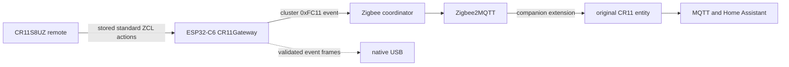

# ORVIBO CR11S8UZ Gateway

Unlock all eight controls of the ORVIBO ZigBee Smart Sticker `CR11S8UZ` in
Zigbee2MQTT without modifying the remote firmware.

The stock remote exposes four useful selector buttons to a generic coordinator,
but its two lower `+/-` rockers are stateful controls for the device selected by
the upper buttons. The remote refuses the coordinator's valid `0x0000` network
address because its firmware also uses zero as an unresolved-address sentinel.
This project gives the remote a target it accepts: an ESP32-C6 with four Zigbee
light endpoints. The gateway translates the resulting standard ZCL commands
back into `button_1` through `button_8` actions on the original CR11 entity.

No CR11 soldering, reflashing, patched coordinator firmware, Wi-Fi, BLE, or
cloud service is required.

## What you get

- `button_1` through `button_8`, with click, hold, and release where the stock
  remote produces them;
- optional contextual names such as `button_5_click_selected_3`;
- a two-click Zigbee2MQTT setup flow with live `0/12` progress;
- an explicit one-click restore to stock direct mode;
- a production-oriented ESP32-C6 firmware with BOOT-button commissioning,
  RGB status, a Zigbee2MQTT heartbeat lease, watchdog recovery, and native USB
  event output;
- checksummed prebuilt firmware and a guarded flashing tool;
- external Zigbee2MQTT converters and an extension, with no patch to the
  Zigbee2MQTT installation;
- host tests, converter tests against the exact supported Zigbee2MQTT image,
  and a repository policy gate.

## Architecture



The gateway is an always-on Zigbee End Device, not a Router. It cannot become a
parent for battery devices and does not carry unrelated mesh traffic. Four
Dimmable Light endpoints preserve the remote's selected-target context; a
separate vendor endpoint transports a fixed, versioned event packet to the
coordinator.

## Supported baseline

| Component | Supported and tested version |
|---|---|
| Remote | ORVIBO CR11S8UZ, firmware `v3.1.04_20160520` |
| Remote model IDs | `51725b7bcba945c8a595b325127461e9`, `3c4e4fc81ed442efaf69353effcdfc5f` |
| Gateway board | ESP32-C6-DevKitC-1 v1.2, 8 MB flash |
| Gateway firmware | `0.9.3`, built with ESP-IDF `5.5.4` |
| Zigbee library | Espressif `esp-zigbee-lib 2.0.3` |
| Zigbee2MQTT | `2.13.0` |
| zigbee-herdsman-converters | `26.90.0` in the tested image |
| Flashing tool | `esptool 5.3.1` |

External JavaScript interfaces are not a stable Zigbee2MQTT API. Treat newer
Zigbee2MQTT releases as untested until the included converter suite passes.

## Quick start

Read the full [installation guide](docs/INSTALLATION.md) before erasing a board.
The compact path is:

```sh
git clone https://github.com/Skydev0h/cr11s8uz-gateway.git
cd cr11s8uz-gateway
python3 -m venv .venv
./.venv/bin/python -m pip install -r requirements-flash.txt
./.venv/bin/python scripts/flash_firmware.py factory --port /dev/serial/by-id/YOUR_ESP32_C6_UART
```

Then install the three Zigbee2MQTT files into the directory containing its
`configuration.yaml`:

```sh
python3 scripts/install_z2m.py --data-dir /path/to/zigbee2mqtt/data --dry-run
python3 scripts/install_z2m.py --data-dir /path/to/zigbee2mqtt/data
```

Enable external JavaScript and restart Zigbee2MQTT:

```yaml
advanced:
  enable_external_js: true
```

Join the gateway, join or wake the CR11, enter the remote's assignment mode,
and click **Configure** under **Route through CR11Gateway**. The UI confirms
each of the 12 records before reporting `gateway_ready`.

## Button map

| Action | Physical control | Internal key | Gateway endpoint |
|---|---|---:|---:|
| `button_1` | left upper `●` | K3 | 10 |
| `button_2` | right upper `■` | K11 | 12 |
| `button_3` | left middle `● ●` | K7 | 11 |
| `button_4` | right middle `■ ■` | K15 | 13 |
| `button_5` | left lower `+` | K4 | selected left endpoint |
| `button_6` | left lower `-` | K8 | selected left endpoint |
| `button_7` | right lower `+` | K12 | selected right endpoint |
| `button_8` | right lower `-` | K16 | selected right endpoint |

In `plain` mode, lower actions look like `button_5_click`. In `selected` mode,
the same event can be `button_5_click_selected_1`. Upper actions keep their
normal names in both modes.

## Repository layout

- [`firmware/`](firmware/) contains the complete ESP-IDF source and host tests.
- [`firmware/prebuilt/v0.9.3/`](firmware/prebuilt/v0.9.3/) contains the factory
  and application-only release images, a manifest, and SHA-256 checksums.
- [`zigbee2mqtt/`](zigbee2mqtt/) contains two external converters and one
  external extension.
- [`scripts/`](scripts/) contains guarded install, flash, release, and policy
  tools.
- [`docs/PROTOCOL.md`](docs/PROTOCOL.md) records the reverse-engineered protocol
  and its evidence boundaries.
- [`docs/NATIVE_USB.md`](docs/NATIVE_USB.md) specifies the direct event stream.
- [`docs/images/cr11s8uz-pcb-reverse-engineering.jpg`](docs/images/cr11s8uz-pcb-reverse-engineering.jpg)
  is the annotated CR11 PCB trace map used during the investigation.

## Safety and privacy

The repository deliberately excludes the original ORVIBO application, the
dumped CR11 firmware, captures, Zigbee network keys, coordinator backups,
device databases, and live Zigbee device or network identifiers. The firmware
flasher verifies all release hashes and requires an explicit confirmation before
a factory erase. The Zigbee2MQTT installer never edits `configuration.yaml`,
never restarts a service, and backs up a conflicting managed file only when
`--replace` is explicitly requested.

External converters and extensions execute inside the Zigbee2MQTT process.
Review them and install only from a checkout you trust.

## Known limitations

- Exactly one joined `CR11Gateway` is supported per Zigbee2MQTT instance.
- Gateway mode is intentionally a single point of failure. Direct mode remains
  available even if no gateway is present.
- A full stock CR11 join clears its action tables; configure gateway mode again
  afterward.
- The examined CR11 firmware has a broken Big-table query handler. Successful
  write acknowledgements plus end-to-end button tests are authoritative;
  readback is not.
- The CR11 caches the gateway's resolved 16-bit network address per action. If
  the gateway rejoins with a different network address, rewrite the 12 records.
- Gateway RSSI is the CR11-to-gateway last hop, not CR11-to-coordinator RSSI.
- Zigbee `action` values are events. Consumers should use MQTT messages or Home
  Assistant device triggers, not rely on a value changing between identical
  consecutive presses.

## Documentation

- [Installation and daily operation](docs/INSTALLATION.md)
- [Gateway firmware and LED interface](docs/FIRMWARE.md)
- [Reverse-engineered CR11 protocol](docs/PROTOCOL.md)
- [Native USB event path](docs/NATIVE_USB.md)
- [Troubleshooting](docs/TROUBLESHOOTING.md)
- [Building, testing, and releasing](docs/DEVELOPMENT.md)
- [Security policy](SECURITY.md)

## Upstream references

- [Zigbee2MQTT external converters](https://www.zigbee2mqtt.io/advanced/more/external_converters.html)
- [Zigbee2MQTT external extensions](https://www.zigbee2mqtt.io/advanced/more/external_extensions.html)
- [Zigbee2MQTT external JavaScript setting](https://www.zigbee2mqtt.io/guide/configuration/all-settings.html)
- [ESP32-C6-DevKitC-1 v1.2 user guide](https://docs.espressif.com/projects/esp-dev-kits/en/latest/esp32c6/esp32-c6-devkitc-1/user_guide.html)
- [ESP-IDF ESP32-C6 build and flash guide](https://docs.espressif.com/projects/esp-idf/en/latest/esp32c6/get-started/start-project.html)
- [esptool basic commands](https://docs.espressif.com/projects/esptool/en/latest/esp32c6/esptool/basic-commands.html)

## License and attribution

Original project code is licensed under MIT. Two small timer source files retain
their Espressif CC0-1.0 notices. See [THIRD_PARTY_NOTICES.md](THIRD_PARTY_NOTICES.md).

ORVIBO and Zigbee are trademarks of their respective owners. This project is
independent and is not affiliated with or endorsed by ORVIBO.
